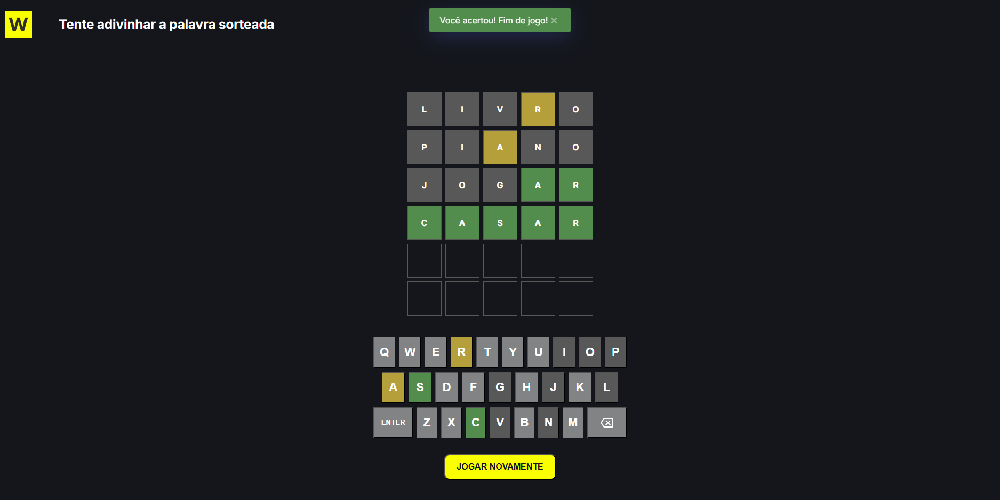

<p align="center">
  
</p>

# Termo Game 🟩

Versão do jogo de adivinhação de palavras Wordle, desenvolvido durante o desafio **#7DaysOfCode da Alura** com foco em JavaScript puro e manipulação de DOM.

Link de acesso: https://alura-challenge-dom-js.vercel.app/

## Tech Stack

[](https://skillicons.dev)

## Regras do Jogo

- A palavra sorteada tem sempre **5 letras**
- O jogador tem **6 tentativas** para acertar
- A cada tentativa, as letras são coloridas:
  - 🟩 **Verde** — letra na posição correta
  - 🟨 **Amarelo** — letra existe na palavra mas está fora do lugar
  - ⬛ **Cinza** — letra não existe na palavra
- O teclado virtual também é colorido conforme os palpites
- Letras repetidas são tratadas respeitando a quantidade de ocorrências na palavra
- Ao acertar ou esgotar as tentativas, o jogo é encerrado e um botão de reinício é exibido

## Getting Started

1. **Clone o projeto**: `git clone https://github.com/Manuella-Maia/alura-challenge-DOM-JS.git`
2. **Instale as dependências**: `npm install`
3. **Abra o projeto**: abra o `index.html` com a extensão **Live Server** no VS Code

## Rodando os testes

```bash
# Rodar apenas testes de sorteio
npx jest tests/randomly-word.test.js

# Rodar apenas testes de API
npx jest tests/load-words.test.js

# Rodar apenas testes de DOM
npx jest tests/game.test.js

# Rodar apenas testes de validação da cor das letras
npx jest tests/letter-status.test.js

# Rodar apenas testes de Exibição de notificações
npx jest tests/show-notifications.test.js

# Ver detalhes de cada teste (passou/falhou com descrição)
npx jest --verbose

# Rodar em modo watch (reroda automaticamente ao salvar um arquivo)
npx jest --watch

# Ver cobertura de código (quais linhas do script.js estão sendo testadas)
npx jest --coverage

# Rodar todos os testes
npx jest
```

## License

Este software está disponível sob a licença [MIT](https://rem.mit-license.org)

