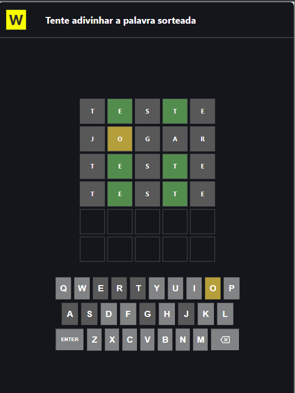

# 🧪 Documentação de Testes - Wordle Challenge

Este documento detalha a estrutura de testes unitários implementada no projeto utilizando o **Jest**. O objetivo é garantir que o motor do jogo (carregamento de dados e sorteio) funcione de forma isolada e segura.

---

## 🛠️ Comandos do Terminal

| Objetivo | Comando |
| :--- | :--- |
| **Executar todos os testes** | `npm test` |
| **Relatório detalhado (Verbose)** | `npm test -- --verbose` |
| **Limpar cache do Jest** | `npm test -- --clearCache` |
| **Modo Observador (Watch)** | `npx jest --watchAll` |

---

## 🏗️ Configurações de Módulos

Atualmente, o projeto utiliza o padrão **ES Modules (ESM)** para permitir o uso de `import` e `export`.

### 1. Configuração no `package.json`
Para que o Jest suporte a sintaxe moderna, a configuração deve ser:
```json
{
  "type": "module",
  "scripts": {
    "test": "node --experimental-vm-modules node_modules/jest/bin/jest.js"
  }
}
```

## 2. Exportação no script.js
As funções devem ser exportadas individualmente:

JavaScript
export const loadWords = async () => { ... };
export const randomlyWord = (words) => { ... };

import { jest } from '@jest/globals';

Caso opte por não usar type: module, a configuração muda para:

Exportar: module.exports = { loadWords, randomlyWord };

Importar: const { loadWords, randomlyWord } = require('../script.js');

# Rodar apenas testes de sorteio
npx jest tests/randomly-word.test.js

# Rodar apenas testes de API
npx jest tests/load-words.test.js

# Rodar apenas testes de DOM
npx jest tests/game.test.js

# Rodar apenas testes de validação da cor das letras
npx jest tests/letter-status.test.js

# Rodar apenas testes de Exibição de notificações
npx jest tests/show-notifications.test.js

# Ver detalhes de cada teste (passou/falhou com descrição)
npx jest --verbose

# Rodar em modo watch (reroda automaticamente ao salvar um arquivo)
npx jest --watch

# Ver cobertura de código (quais linhas do script.js estão sendo testadas)
npx jest --coverage

# Rodar todos os testes
npx jest

imagem que demostra erro no evento do keydown e do clik
deveria adcionar a classe nos butoes, mesmo no evento keydon
